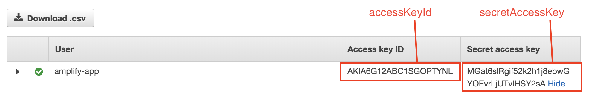
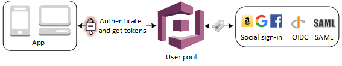

# Lab 2: AWS Amplify


AWS Amplify provides a declarative and easy-to-use interface across different categories of cloud operations. AWS Amplify goes well with any JavaScript based frontend workflow, and React Native for mobile developers.

In this project, we will show you how to use Amplify to quickly setup an authentication backend (via Cognito) and a GraphQL API endpoint (via AppSync).

Note that Amplify is not an AWS Service, but an [open source javascript library](https://github.com/aws-amplify/amplify-js).

## Table of Contents:
* [Initialise a development project](#initialise-a-development-project)
* [Setup a Cognito user pool](#add-cognito-user-pool)
* [Create a Cognito user](#create-a-cognito-user)

## Initialise a development project

We have prepared a sample app for you in this exercise. You can clone the repo into another folder and copy the content to your `rn` folder with the following commands:

```
cd /code
git clone https://github.com/ykbryan/aws-amplify-sample-react-native-app app
mv app/* .
rm -Rf app/
```

Run this command inside the react-native docker environment.

**IMPORTANT**: Ensure you are in the ```/code``` directory.
```
amplify init
```

Follow the commands in the following, take note that the `project's sourced directory` is ``.``
```
? Enter a name for the project (code) ❯ react-native-app
```
```
? Enter a name for the environment ❯ dev
```
```
? Choose your default editor: ❯ None
```

```
? Choose the type of app that you're building ❯ javascript
```
```
? What javascript framework are you using ❯ react-native
```
```
? Source Directory Path: ❯ /
```
```
? Distribution Directory Path: ❯ /
```
```
? Build Command: ❯ npm run-script build
```
```
? Start Command: ❯ npm run-script start
```
```
Using default provider  awscloudformation
AWS access credentials can not be found.
? Setup new user ❯ Yes

Follow these steps to set up access to your AWS account:
Sign in to your AWS administrator account:
https://console.aws.amazon.com/
Press Enter to continue
```
At this stage, we will setup an AWS user for use in Amplify. Press Enter to proceed.

```
Specify the AWS Region
? region: ❯ ap-southeast-1
```
```
Specify the username of the new IAM user:
? user name: ❯ amplify-user
```
```
Complete the user creation using the AWS console
https://console.aws.amazon.com/iam/home?region=undefined#/users$new?step=final&accessKey&userNames=amplify-user&permissionType=policies&policies=arn:aws:iam::aws:policy%2FAdministratorAccess
Press Enter to continue
```
You will be prompted to open up the URL which will link you to an IAM console for the creation of the user.

Proceed to create an IAM user with **AdministratorAccess** Permission attached.

At the creation success page, you will see the **Access Key ID** and **Secret Access Key**. Copy them into the prompt and continue.



```
Enter the access key of the newly created user:
? accessKeyId:  **********
? secretAccessKey: ********************
```
```
This would update/create the AWS Profile in your local machine
? Profile Name: ❯ default

Successfully set up the new user.

For more information on AWS Profiles, see:
https://docs.aws.amazon.com/cli/latest/userguide/cli-multiple-profiles.html
```
```
? Do you want to use an AWS profile? ❯ Y
```
```
? Please choose the profile you want to use. ❯ default
```

Then you should see a bunch of `CREATE_IN_PROGRESS` commands running at the background for you. These are CloudFormation templates that are automatically generated via the `amplify init` command.

You should see this output:
```
✔ Successfully created initial AWS cloud resources for deployments.

Your project has been successfully initialized and connected to the cloud!

Some next steps:
"amplify status" will show you what you've added already and if it's locally configured or deployed
"amplify <category> add" will allow you to add features like user login or a backend API
"amplify push" will build all your local backend resources and provision it in the cloud
"amplify publish" will build all your local backend and frontend resources (if you have hosting category added) and provision it in the cloud

Pro tip:
Try "amplify add api" to create a backend API and then "amplify publish" to deploy everything
```
Congratulations! You have successfully initialized Amplify for use in your environment.

## Setup a Cognito user pool

We need a way to authenticate the users of our app. For this lab, we will use Amazon Cognito User Pool as our user directory. User pools are user directories that provide sign-up and sign-in options for your web and mobile app users.

Your users can also sign in through social identity providers like Facebook, Google or Amazon, or through SAML identity providers (e.g. corporate ADFS).



Setting it up is as simple as running the command below inside the react-native docker environment.

```
amplify auth add
```

You should see:

```
Using service: Cognito, provided by: awscloudformation
 The current configured provider is Amazon Cognito.
 Do you want to use the default authentication and security configuration? (Use arrow keys)
❯ Yes, use the default configuration.
  No, I will set up my own configuration.
  I want to learn more.
```

You can choose to setup your own configuration. At this point, let's choose the **default configuration**. Press `Enter`

You should see:
```
How do you want users to be able to sign in when using your Cognito User Pool? (Use arrow keys)
❯ Username
  Email
  Phone Number
  Email and Phone Number
  I want to learn more.
```
You will see the default list of attributes that are required for signing up. Press **Enter**.
```
What attributes are required for signing up? <Enter>
```
```
Successfully added resource cognito80421876 locally

Some next steps:
"amplify push" will build all your local backend resources and provision it in the cloud
"amplify publish" will build all your local backend and frontend resources (if you have hosting category added) and provision it in the cloud
```

We will now push the settings to your AWS account. This will create a Cognito User Pool automatically for you via CloudFormation.

Run this command inside the react-native docker environment:
```
amplify push
```

At this point, you can see a table that shows the overall changes that are going to be made:
```
| Category | Resource name   | Operation | Provider plugin   |
| -------- | --------------- | --------- | ----------------- |
| Auth     | cognito80421876 | Create    | awscloudformation |
? Are you sure you want to continue? (Y/n)
```

Press `Y` and `Enter` to confirm. This will take a few minutes to run. Once done, you should see the following:

```
✔ All resources are updated in the cloud
```

Your Cognito User Pool has been setup with the default configurations via a CloudFormation template in the background. We shall proceed to add some users into it next.

## Create a Cognito user
1. Let's set up a user for testing. Navigate to your [Cognito Console](https://console.aws.amazon.com/cognito/home)

2. Select **Manage User Pools**


3. Select the **Cognito User Pool** that was generated by Amplify and click on Users and groups.


4. Click **Create User** to begin

5. Fill up the form to create your first user in Cognito for testing purpose in the next lab. At this time, you do not need a real phone number and email. Refer to the screenshot below for more information and click **Create User** to proceed.


6. Check that your newly created user is in the users table with Enabled column set to **ENABLED** and the Account Status column set to **FORCE_CHANGE_PASSWORD**.

You have successfully configured authentication via Cognito for your mobile app. Next, you can proceed to [Lab 3](../appsync/README.md) to work on setting up the GraphQL API via AWS AppSync.
