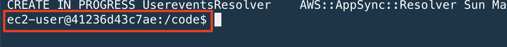

# React Native App with AWS Mobile Hub & AppSync

## Prerequisite

[Setup Cloud9](../setup/)

[Setup Amplify](../amplify/)

[Setup AppSync](../appsync/)

## Setup & Run The React Native App

Make sure you are **inside React Native Docker** environment. You can do a quick check in your Cloud9 console that you are running in the Docker `bash` by checking that your username is `ec2-user`:



If not, run the `bash` command again:
```
cd ~/environment/rn

docker run -it --rm -p 19000:19000 -p 19001:19001 \
-v "$PWD:/code" --user $UID \
-v /home/ec2-user/.aws:/home/ec2-user/.aws \
-v /home/ec2-user/.awsmobilejs:/home/ec2-user/.awsmobilejs \
-e REACT_NATIVE_PACKAGER_HOSTNAME=`curl -s http://169.254.169.254/latest/meta-data/public-ipv4` \
 reactnative-expo:latest bash

```

You can now run the following command:
```
cd /code && yarn
yarn start
```

**Note**: if your `yarn` is **outdated**, please enter the following command to upgrade `yarn`:
```
curl -o- -L https://yarnpkg.com/install.sh | bash
```

**Note** if you see the following **no space left** error, please restart your Cloud9 instance.
```
Error: ENOSPC: no space left on device, write
error Could not write file "/code/yarn-error.log": "ENOSPC: no space left on device, write"
error An unexpected error occurred: "Command failed.
Exit code: 1
```

## Run your App in Expo

Once you have successfully ran `yarn start` without any errors, you should see the following screen on the Docker terminal.


Follow following instructions to get this application to work on your phone.

**iPhone users** On your safari, follow the steps. (The QR code does not work)
```
1. Open a new tab on your safari
2. In the URL/search bar, enter the url in the format of exp://<ip adderss> from your Docker terminal.
3. For our case, it was exp://13.250.105.6:19000
```

**Android users** Open your camera app, follow the steps
```
1. Point your camera at the QR code that appears on your Docker terminal
```

:warning: Once you successfully launch the app, you will realise that the app will display some errors. **This is intended!** Right now, the app has some GraphQL codes that are **missing**. Challenge yourself to fix these codes in the section below.

## Bonus Exercise

Head over back to your Cloud9 console. Navigate to the React Native app source code located in `rn/src/screens/`. Follow the below tasks and find the file to complete the code. The sections will be indicated by `//TODO: ` within.

**Task 1:** Complete the Graphql **query** events at `screens/home/Home.js`. Notice that `const AllEventsQuery` is returning empty string. Write in the graphql query to return the full list of Events to be listed in the Home screen.

**Task 2:** Complete the graphql **mutation** events at `screens/event/EventDetail.js`.

**Task 3** Complete the graphql **subscription** to get new messages at `screens/event/ChatRoom.js`.

:balloon: **Protips:**
  - You might want to refer to the [Schema diagram in Lab 3](../appsync/README.md) to help you with the fields for writing the query.
  - Look at the list of Query, Mutation and Subscription available from the [Schema](https://ap-southeast-1.console.aws.amazon.com/appsync/home) page.
  - You can use the [Queries Simulator mentioned in Lab 3](../appsync/README.md) to test your queries as well. It prompts dropdown list of available actions when you start typing.
  - If you sniff around the codes in `screens/`, you will be able to find some sample codes on how a query, mutation is performed.
